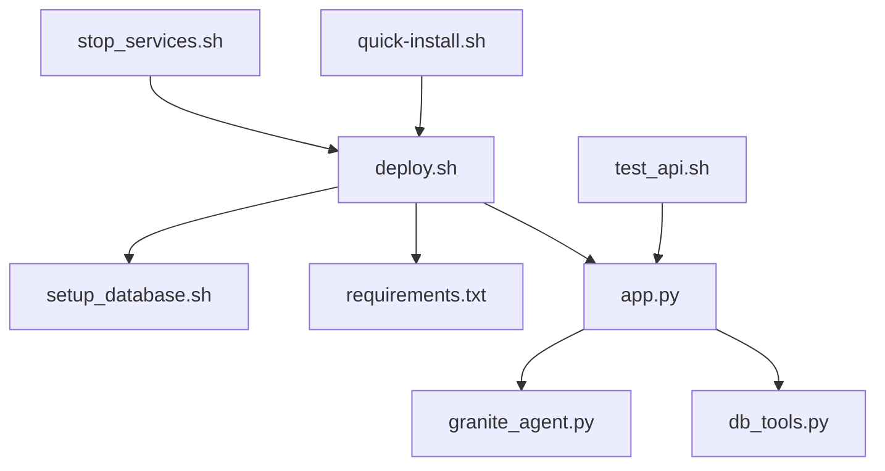

# RHAIIS Demo Project Structure

```
rhaiis-demo/
├── README.md                    # Main documentation and quick start guide
├── quick-install.sh            # One-command system setup script
├── PROJECT_STRUCTURE.md        # This file - explains project layout
├── RHEL_VLLM_SETUP.md          # Legacy vLLM setup documentation  
├── TESTING_CHECKLIST.md        # Manual testing procedures
│
└── app/                        # Main application directory
    ├── app.py                  # Flask web application and API endpoints
    ├── granite_agent.py        # IBM Granite AI agent with tool calling
    ├── db_tools.py             # Database connection and CRM data tools
    ├── requirements.txt        # Python dependencies
    │
    ├── deploy.sh               # Main deployment script
    ├── setup_database.sh       # PostgreSQL database setup
    ├── stop_services.sh        # Stop all running services
    ├── test_api.sh             # Comprehensive API testing script
    │
    ├── DEPLOYMENT_CHECKLIST.md # Step-by-step deployment verification
    └── TROUBLESHOOTING.md      # Comprehensive problem resolution guide
```

## Core Components

### Application Files

- **`app.py`**: Flask REST API server that handles HTTP requests and routes them to the AI agent or database tools
- **`granite_agent.py`**: AI agent class that loads IBM Granite model and provides intelligent CRM analysis
- **`db_tools.py`**: Database interface that connects to PostgreSQL and executes CRM queries

### Deployment Scripts

- **`deploy.sh`**: Main deployment script that sets up the entire demo environment
- **`setup_database.sh`**: Creates PostgreSQL container and loads sample CRM data
- **`stop_services.sh`**: Cleanly stops all running services and containers

### Testing & Validation

- **`test_api.sh`**: Comprehensive test suite that validates all API endpoints and AI functionality
- **`DEPLOYMENT_CHECKLIST.md`**: Step-by-step checklist for successful deployment
- **`TROUBLESHOOTING.md`**: Common issues and solutions

### Installation & Setup

- **`quick-install.sh`**: Automated system setup for fresh RHEL installations
- **`requirements.txt`**: Python package dependencies
- **`README.md`**: Complete documentation with installation and usage instructions

## File Dependencies



## Execution Flow

1. **System Setup**: `quick-install.sh` → GPU drivers + reboot
2. **Demo Deployment**: `deploy.sh` → database setup + AI model loading + Flask API
3. **Testing**: `test_api.sh` → comprehensive API validation
4. **Cleanup**: `stop_services.sh` → graceful service shutdown

## Configuration Files

All configuration is embedded in the scripts with sensible defaults:
- Database credentials in `setup_database.sh`
- AI model settings in `granite_agent.py`
- API endpoints in `app.py`
- Python dependencies in `requirements.txt`

## Runtime Generated Files

During deployment, these files are created:
- `flask.log` - Application logs
- `flask.pid` - Flask process ID
- `~/.cache/huggingface/` - Downloaded AI model cache
- Container volumes for PostgreSQL data

## Key Features by File

| File | Key Features |
|------|--------------|
| `granite_agent.py` | GPU acceleration, tool calling, business intelligence |
| `app.py` | REST API, health checks, chat interface |
| `db_tools.py` | SQL queries, data formatting, connection pooling |
| `deploy.sh` | Dependency installation, service orchestration |
| `test_api.sh` | End-to-end testing, response validation |

This structure provides a complete, self-contained demonstration environment that can be deployed on any compatible RHEL system with minimal prerequisites.
